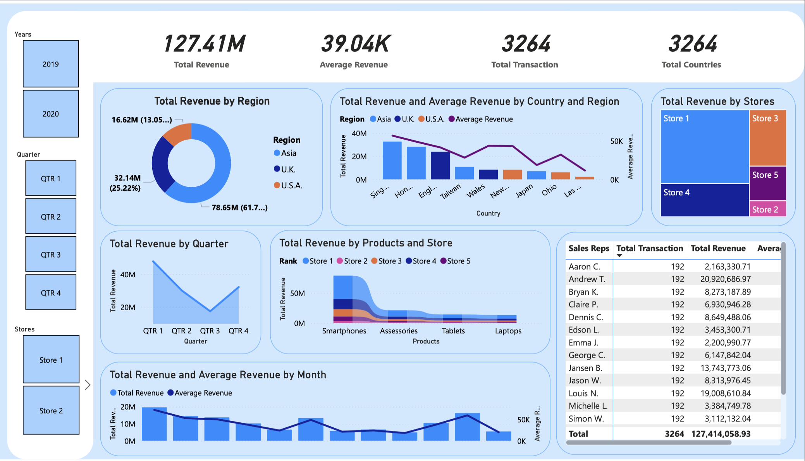

# Power BI Dashboard for Financial Analysis

## What is Power BI?

Power BI is a powerful business analytics tool from Microsoft that enables you to visualize your data and share insights across your organization, or embed them in an app or website. Power BI provides a robust platform for transforming raw data into informative dashboards and reports, facilitating data-driven decision-making.

Today, I used Power BI to create a comprehensive dashboard using a financial dataset. The experience was seamless, thanks to the intuitive interface and extensive range of visualization options, making the process of data visualization and dashboard creation straightforward and efficient.

## My Key Learnings

1. **Data Preparation and Import:** Power BI offers versatile data preparation capabilities, supporting connections to various data sources and providing tools to clean and transform the data as needed.
2. **Visualization Tools:** The platform includes an extensive library of visualizations, such as charts, graphs, and tables, which can be tailored to meet specific data analysis requirements.
3. **Interactivity and Filters:** Enhancing the user experience with interactive elements like slicers and filters allows for more detailed exploration of data points.
4. **Collaboration and Sharing:** Power BI enables easy sharing and collaboration on dashboards and reports, facilitating team-based data analysis and strategy development.

## Final Thoughts

Working with Power BI has been a highly educational and rewarding experience. It is a robust tool for creating interactive and dynamic dashboards, making data analysis more accessible and actionable. The ability to customize visualizations and integrate various data sources adds significant value, allowing for comprehensive data analysis and more informed decision-making.

Overall, Power BI stands out as a versatile BI tool that combines user-friendliness with advanced analytical capabilities. Whether for small businesses or large enterprises, Power BI caters to diverse data visualization needs effectively. I am excited to explore more advanced features and utilize Power BI for future data analysis projects.
